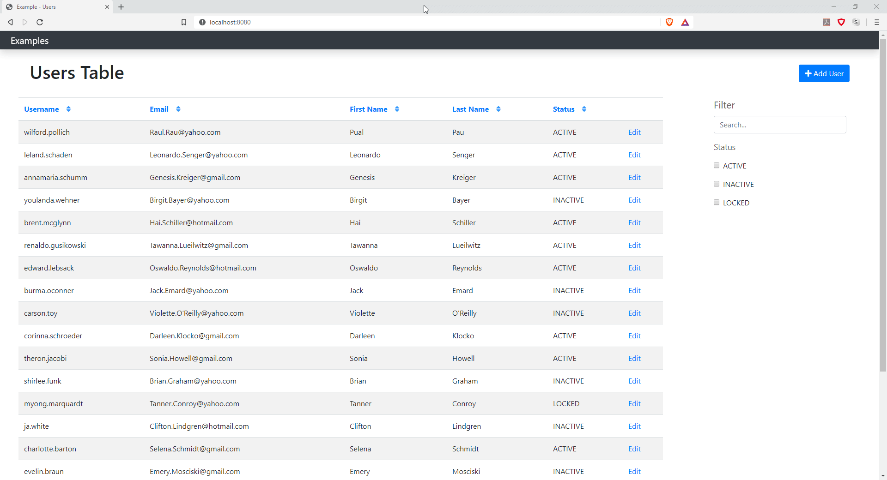

### Simple Thymeleaf Backend Rendering Application

This is a simple self contained Spring Boot app to demonstrate backend rendering and validation with Thymeleaf. 
Backend rendering can make input field validation easy with the use of ajax as you can submit forms and re-render the form 
after it has been validated on the backend. Pageable tables can also be handled simply with backend rendering as it's just HTML and CSS
and no need for a lot of extensive javascript or javascript libraries which are hard to customize.

The use of jQuery's delegation and backend render of partial HTML reduces the complexity and increases the speed of application development as the view is just simple HTML and CSS. 
The business logic for validation is contained to the backend and does not spill over to the frontend.

Thymeleaf Extensions:
  - Layout templates: https://github.com/ultraq/thymeleaf-layout-dialect
  - Pagination: https://github.com/jpenren/thymeleaf-spring-data-dialect

Front End Components:
- gulp
- webpack
- bootstrap
- fontawesome

## Running the App
````
mvn spring-boot:run
````

## Building Frontend
````
cd frontend
gulp build
````
or
````
cd frontend
npm run build
````

## Building the App
````
mvn clean install
````

## Demostration
